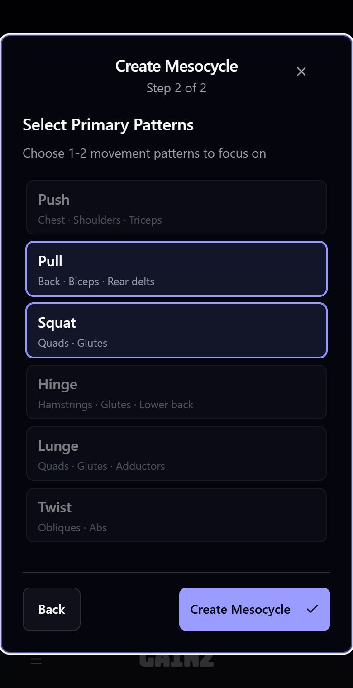
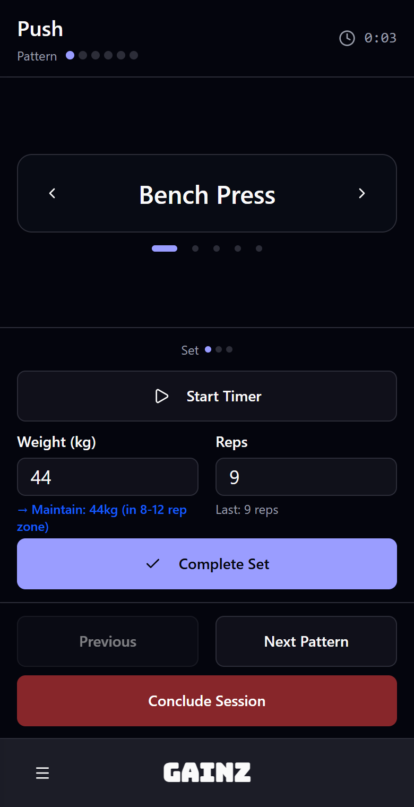

# Gainz

A workout tracker for hypertrophy training, built around movement patterns instead of fixed exercise lists.

You pick one or two patterns to focus on for a training block and choose an exercise at each set. The app decides the order, the number of sets, the weight to try next and how long to rest.

<p>
  
  
</p>

## How it works

**Patterns.** Every exercise belongs to one of six movement patterns: Push, Pull, Squat, Hinge, Lunge and Twist.

**Mesocycles.** A mesocycle is a training block of 4, 6, 8 or 12 weeks with one or two primary patterns. The other patterns get one maintenance set per session. You can queue several mesocycles and reorder them by dragging.

**Volume.** When you activate a mesocycle you choose 2 to 5 sessions per week and 10 to 20 weekly sets per primary pattern. The app only offers set counts that divide evenly across your sessions, and shows the estimated session length for each choice.

**Workouts.** A workout shows one pattern at a time, primary patterns first. Maintenance patterns unlock once the primary sets are done. Each set can use a different exercise from the pattern, so you can switch when a machine is taken.

**Progression.** The target is 8 to 12 reps per set. After a set of 12 or more reps it suggests 2.5 kg more. After a set under 8 reps it suggests 2.5 kg less.

**Rest.** A rest timer starts after every set and sends a browser notification when it ends.

**Build-up and deload.** If you are starting fresh, weeks 1 and 2 run at 50% volume and weeks 3 and 4 at 75%. The final week of every mesocycle is a deload at half volume.

**History.** Past workouts are available as a list, a calendar, and charts of volume per pattern, progress per exercise and mesocycle comparison.

The app installs as a PWA. [CORE_TENETS.md](CORE_TENETS.md) explains the reasoning behind these rules.

## Stack

- [TanStack Start](https://tanstack.com/start) with React 19 and file-based routing
- [Convex](https://convex.dev) for the database and backend functions
- [Better Auth](https://www.better-auth.com) on Convex, with email and password and optional Google sign-in
- Tailwind CSS 4 and shadcn/ui
- Recharts for charts, dnd-kit for drag and drop

## Run it locally

You need Node 20 or newer.

```bash
npm install
npx convex dev
```

The first run of `npx convex dev` asks you to log in, creates a deployment and writes `CONVEX_DEPLOYMENT` and `VITE_CONVEX_URL` to `.env.local`. Leave it running.

In a second terminal, set the auth secret, seed the patterns and exercises, and start the app:

```bash
npx convex env set BETTER_AUTH_SECRET "$(openssl rand -base64 32)"
npx convex run seed:seedAll
npm run dev
```

Open http://localhost:3000 and create an account with an email and password.

### Without a Convex account

Convex can run a local backend with no login:

```bash
CONVEX_AGENT_MODE=anonymous npx convex dev
```

Then add these lines to `.env.local` and follow the same steps as above:

```
VITE_CONVEX_SITE_URL=http://127.0.0.1:3211
VITE_SITE_URL=http://localhost:3000
```

### Google sign-in

Google sign-in is off until you add credentials. See [GOOGLE_AUTH_SETUP.md](GOOGLE_AUTH_SETUP.md).

### Sample data

To fill the history with ten completed workouts from the last eight weeks:

```bash
npx convex run seed:seedRecentWorkouts '{"userId": "<your user id>"}'
```

Your user id is the `_id` in the `user` table of the `betterAuth` component, visible in the Convex dashboard.

## Scripts

| Command          | What it does                                |
| ---------------- | ------------------------------------------- |
| `npm run dev`    | Start the app on port 3000                  |
| `npm run build`  | Build for production                        |
| `npm run tc`     | Type-check                                  |
| `npm run lint`   | Run ESLint                                  |
| `npm run format` | Check formatting with Prettier              |
| `npm run qg`     | Type-check, format check and lint in one go |
| `npm run test`   | Run Vitest. There are no tests yet          |

## Project layout

```
convex/            Schema, queries, mutations and seed functions
src/routes/        Pages
src/features/      Components and hooks per feature: auth, dashboard, mesocycle, workout, history
src/components/ui  shadcn/ui components
```
